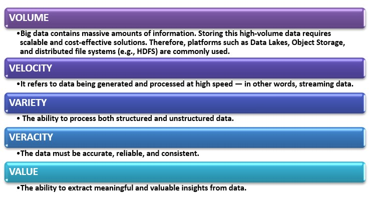

## 🔹 1. The 5 V’s of Big Data

## 🔹 2. Types of Data

- **Structured**: Tabular data, such as data stored in relational databases.
- **Unstructured**: Data like video, audio, and images.
- **Semi-structured**: Data that has some structure but not in tabular form (e.g., XML, JSON).

---

## 🔹 3. Distributed System Architecture

- Data and processes are distributed across multiple servers.
- Provides scalability and fault tolerance.
- Tools like Hadoop HDFS, Spark, and Kafka operate on this architecture.

---

## 🔹 4. Data Life Cycle

1. Ingestion  
2. Storage  
3. Processing  
4. Analysis  
5. Visualization & Decision Making

---

## 🔹 5. Big Data Storage Solutions

- **Distributed File Systems**: HDFS (Hadoop Distributed File System)
- **NoSQL Databases**: Suitable for non-relational, unstructured data (e.g., MongoDB, Cassandra)
- **Cloud-Based Storage**: AWS S3, Google Cloud Storage
- **Object Storage**: Stores data as objects along with metadata (e.g., Amazon S3, Google Cloud Storage)

---

## 🔹 6. File Formats

- **CSV**: Simple plain text with comma-separated values. Easy to use but inefficient for large-scale analytics.
- **JSON**: Human-readable format for semi-structured data.

### Modern File Formats:
- **Avro**: Includes schema, supports efficient serialization.
- **Parquet**: Columnar storage format, ideal for analytics.
- **ORC**: Optimized for Hadoop with compressed columnar format.
- **Protocol Buffers (Protobuf)**: Developed by Google, compact and fast data serialization.

---

## 🔹 7. Data Warehouse, Data Lake, and Lakehouse

- **Data Warehouse**: Analytical database optimized for structured data (e.g., Snowflake, BigQuery)
- **Data Lake**: Stores raw data of all types, typically in cloud environments.
- **Data Lakehouse**: Combines features of data lakes and warehouses (e.g., Delta Lake, Apache Iceberg)

---

## 🔹 8. Data Processing Models

- **Batch Processing**: Processes large volumes of data in batches (e.g., nightly reports).
- **Real-time Processing**: Analyzes streaming data instantly (e.g., clickstream analysis).

---

## 🔹 9. Tools and Technologies

### ✔ HADOOP Ecosystem:
- **Hadoop**: Framework for distributed storage and processing.
- **HDFS**: Hadoop’s file system.
- **Hive**: SQL-like querying for large datasets.
- **Impala**: Fast SQL engine for real-time queries over big data.

### ✔ Spark Ecosystem:
- **Spark**: In-memory distributed computing engine.
- **Spark Streaming**: Processes real-time data streams.

### ✔ Others:
- **Flink**: Real-time and batch processing engine (especially strong in streaming).
- **Kafka**: High-throughput distributed messaging system.
- **Airflow**: Workflow management and data pipeline scheduling tool.

---

## 🔹 10. NoSQL Databases

- **Key Feature**: Flexible schema, ideal for unstructured and semi-structured data.
- **Examples**: MongoDB (document-based), Cassandra (column-based)

---

## 🔹 11. Object Storage

- Stores files as "objects" with metadata.
- Widely used in cloud systems.
- **Examples**: Amazon S3, Google Cloud Storage

---

## 🔹 12. Iceberg & Trino

- **Apache Iceberg**: A table format for big data that supports schema evolution and versioning.
- **Trino**: SQL query engine for querying across multiple data sources (formerly known as Presto)

---

## 🔹 13. Cloud Solutions

- **Cloud Storage**: Object-based data storage (e.g., Google Cloud Storage)
- **Cloud Bigtable**: Distributed NoSQL database with wide-column structure
- **Cloud SQL**: Managed relational databases (e.g., MySQL, PostgreSQL)
- **Cloud Spanner**: Globally distributed, scalable relational database
- **Firestore**: Document-based NoSQL database integrated with Firebase

---
